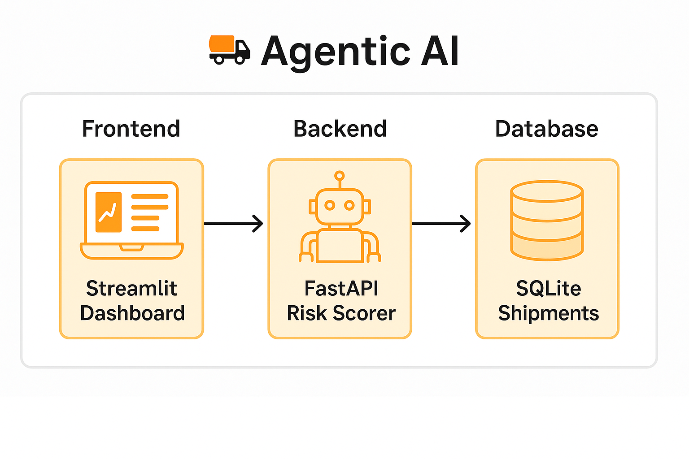

# 🚛 Agentic Logistics AI - Supply Chain Risk Risk Intelligence Dashboard

A dynamic AI-powered platform to detect, analyze, and visualize shipment risks across supply chains using **FastAPI**, **Streamlit**, and **Machine Learning**.

---

## 📖 Problem Statement

In logistics operations, predicting shipment risks is critical to reduce costs, delays, and damages. Traditional methods are static, rely heavily on manual monitoring, and cannot proactively detect dynamic risks such as carrier delays, poor conditions, or operational failures.

---

## 🚀 Solution Overview

This project builds an **Agentic AI Risk Scorer** that automatically:

- Accepts shipment data
- Analyzes and scores potential risks using selected data columns
- Visualizes risk categories (Low, Medium, High, Critical)
- Allows download of risk-enriched datasets
- Provides a clean, interactive dashboard for operations teams

The system is modular and can be **future expanded** to include **real-time weather** and **news-based disruptions** dynamically.

---

## 🛠️ Tech Stack

- **Backend:** FastAPI (Python)
- **Frontend:** Streamlit Dashboard
- **Database:** SQLite (local)
- **Deployment:** Docker-ready
- **Model:** Basic AI Agent Risk Scorer

---

## 📁 Project Structure

| Folder/File | Description |
|:-----------|:------------|
| `app/agent.py` | Core AI agent logic to score risks on shipments. |
| `app/database.py` | Handles SQLite database setup and queries for shipments. |
| `app/main.py` | FastAPI backend server entrypoint. |
| `app/routes.py` | Defines API endpoints for uploading files, running agent, fetching results. |
| `app/__init__.py` | Initializes FastAPI app package. |
| `app/news_api.py` | (Future use) Integrate real-time news alerts (currently not active). |
| `app/weather_api.py` | (Future use) Integrate weather-based risk analysis (currently not active). |
| `data/shipments.db` | SQLite database storing shipment data. |
| `data/Train.csv` | Full dataset sample for model testing. |
| `data/Train_small.csv` | Smaller dataset version for testing. |
| `frontend/dashboard.py` | Streamlit UI dashboard for interacting with backend and visualizing data. |
| `frontend/bg.jpg` | Background image for the Streamlit UI with blur effect. |
| `scripts/` | Folder reserved for utility scripts if needed later. |
| `.env` | Environment variables (API keys, secrets - not mandatory for now). |
| `Dockerfile` | Containerizes the backend server (FastAPI) setup. |
| `main.py` | Main FastAPI entrypoint (alias to `app.main` for Docker). |
| `requirements.txt` | Python dependencies required for backend and frontend. |
| `README.md` | Project documentation (this file). |

---

## ⚡ Quickstart Guide

1. **Clone Repository**
```bash
git clone https://github.com/yourusername/agentic_logistics_ai.git
cd agentic_logistics_ai
```


## 🚀 How to Run the Project

### 2. Start Backend Server (FastAPI)

```bash
uvicorn app.main:app --reload
```

### 3. Start Frontend Dashboard (Streamlit)

```bash
streamlit run frontend/dashboard.py
```

Available at: http://localhost:8501

## 📸 Project Walkthrough

**1. Upload Shipment Data**  
Upload your CSV file containing shipment information.


**2. Select Risk Focus Columns**  
Choose columns that might indicate potential shipment risks.


**3. Run Risk Scorer**  
Launch the AI agent to score all shipments dynamically.


**4. View and Download Results**  
Visualize risk distribution and download enriched shipment data.


---

## 🧩 System Architecture Diagram



---

## 🌟 Future Expansion

- **Weather Integration:** Dynamic risk scores based on real-time weather conditions.
- **News Integration:** Live disruption monitoring based on shipment route news.
- **Smart Re-Routing:** AI suggestions to mitigate or avoid high-risk shipments.

---

## 🛠️ Built With

- Python 3.10+
- FastAPI — Backend REST API framework
- Streamlit — Interactive Frontend Dashboard
- SQLite — Lightweight database for shipments
- Plotly Express — Dynamic visualizations (Pie Charts, Bar Graphs)
- Docker — (Optional) Containerization ready
- Pandas — Data processing
- Requests — HTTP requests handling

## 👨‍💻 Author
Developed and maintained by **Anand Khanna**.
Feel free to connect on LinkedIn (https://linkedin.com/in/anandkhanna15/) or explore more at Portfolio Website (https://anand-1502.github.io/)!
